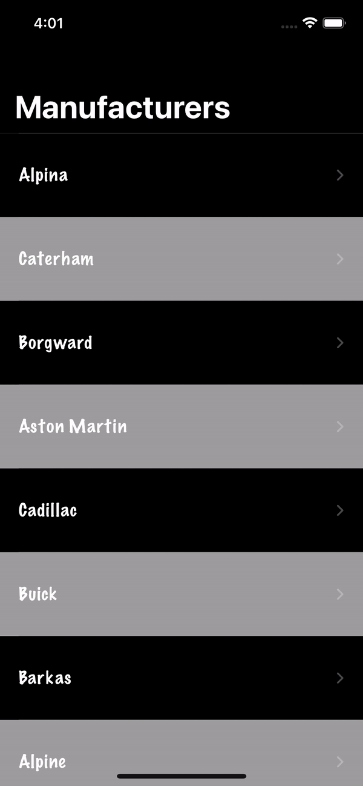

# News App
Sample News App made for learning Unit and UI Testing

### Requirement.
Xcode 13, Swift 5.

### Steps to run the app.
1. Download/Clone the project.
2. Go to `Constants+NetworkLink.swift`
2. Add access token and replace company name with "xxxx" in apiHost.
3. Run it in Xcode.

### Steps to run test cases.
1. `Cmd+U` for running all test cases.
2. For running individual test cases go to specific test case file and click on run from left bar.

### Sample output

### Unit Test Coverage

